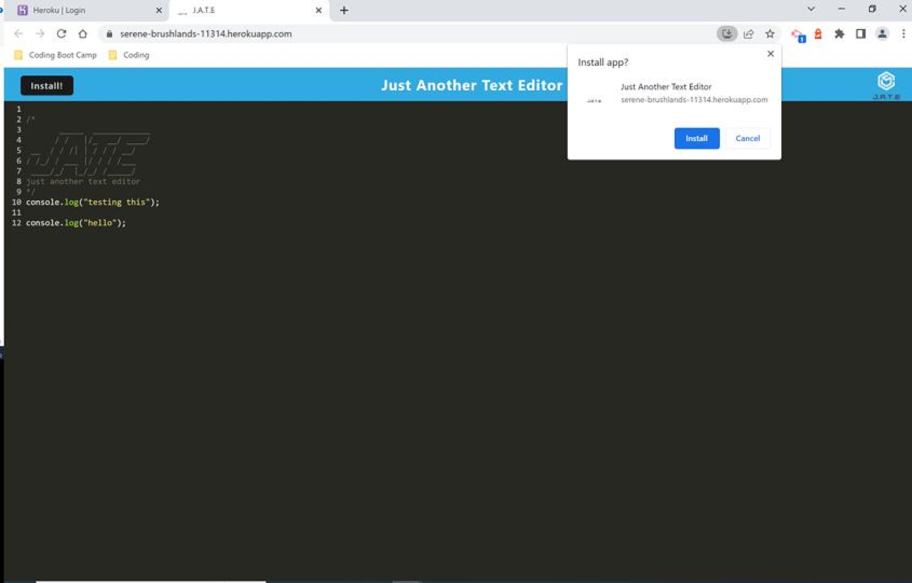
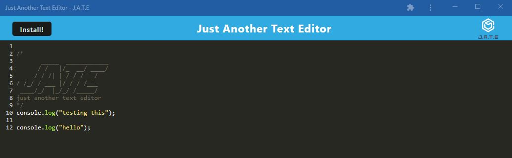
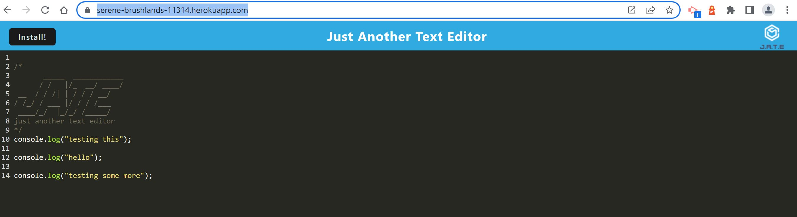

# 19-PWA-text-editor

This application is a text editor that runs in the browser. It is a single-page application that meets PWA criteria, meaning the app will remain fully functional even without internet connection through the use of service worker and cache APIs. The data will still be visible to the user when the app is offline. You can download the app by clicking on the install-button.

The app was build on already existing starter code - various configurations were applied to add the PWA functionality.

# Installation and use

Clone the repo, then run `npm install` in your terminal. Then run one of the available scripts - to build the app, run `npm run start`.

# Built using:

- Express.js
- Webpack
- html-webpack-plugin
- webpack-pwa-manifest
- css-loader & style-loader
- babel-loader
- IndexedDB

# Screenshots

Here are a few screenshots demonstrating the PWA functionality:

The app is installable from the browser window:

The text added in the browser window is available in the downloaded app:

The app is now available on the desktop via this icon:  

The added content in the downloaded text editor is reflected in the browser version of the app:

# Links

- [Github Repository](https://github.com/HenniePenny/19-PWA-text-editor)
- [Deployed Application](https://serene-brushlands-11314.herokuapp.com/)
